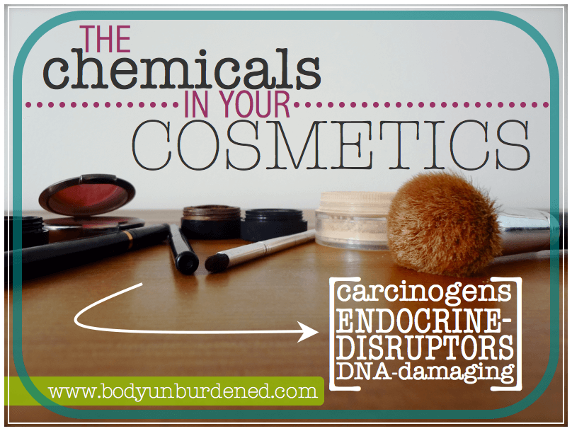
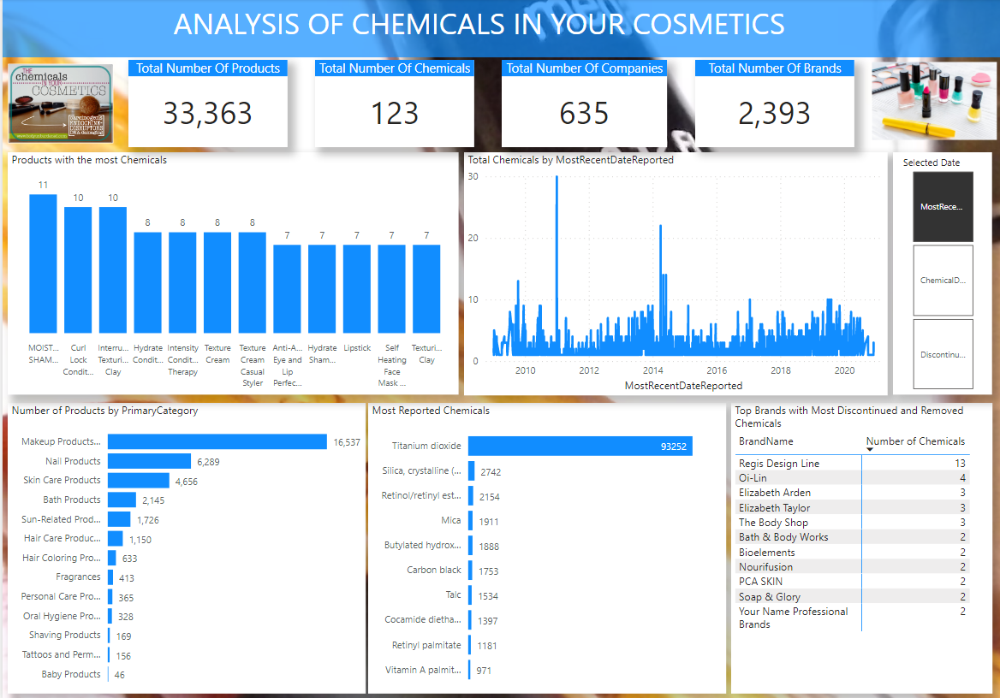

# Chemicals In Cosmetics: What's really in your makeup bag? 
Do you ever wonder what ingredients are in your favorite cosmetics? Did you know that there are over 12,000 chemicals used in cosmetics and personal care products? This dataset contains information on the chemicals used in cosmetics, including the name of the chemical, the company that manufactures it, the primary category it is used in, and the date it was first reported.
So what's really in your makeup bag? Scroll through and take a look at some of the most popular cosmetics ingredients

## About The Dataset
This dataset contains information on the chemicals used in cosmetics, including the name of the chemical, the company that manufactures it, the primary category it is used in, and the date it was first reported. 
The dataset comes with 3 different but related files which include Chemicals-in-cosmetics (main file), chemical-in-cosmetics Data Dictionary and Chemicals-in-cosmetics (subcategory) 
The chemicals-in-cosmetics csv file contains one table. This table contains 114,299 rows including the Headers and 22 columns dropping the index column. 
The Chemical-in-cosmetics Data Dictionary explains what each column in the chemical-in-cosmetics represents and how they are related to each other. While the chemical-in-cosmetics (subcategory) explains how the primary category and the subcategory are related i.e. which subcategories make up a particular primary category 
The file we are going to make use of throughout Data analysis is the Main file, the remaining files are for reference sake. 

## Project Questions
1.	Find out which chemicals were used the most in cosmetics and personal care products.
2.	Find out which companies used the most reported chemicals in their cosmetics and personal care products.
3.	Which brands had chemicals that were removed and discontinued? Identify the chemicals.
4.	Identify the brands that had chemicals which were mostly reported in 2018.
5.	Which brands had chemicals discontinued and removed?
6.	Identify the period between the creation of the removed chemicals and when they were actually removed.
7.	Can you tell if discontinued chemicals in bath products were removed. 
8.	How long were removed chemicals in baby products used? (Tip: Use creation date to tell)
9.	Identify the relationship between chemicals that were mostly recently reported and discontinued. (Does most recently reported chemicals equal discontinuation of such chemicals?)
10.	Identify the relationship between CSF and chemicals used in the most manufactured sub categories. (Tip: Which chemicals gave a certain type of CSF in sub categories?)

## Data Source
This dataset is a public data downloaded from [Chemicals in Cosmetics: What's Really in Your? | Kaggle
](https://www.kaggle.com/datasets/thedevastator/chemicals-in-cosmetics-what-s-really-in-your)

## Data Exploration
During the exploration phase of the Analysis, the following issues were uncovered:

-	All the date columns were of datetime data type.

- Product Name, Company Name and Brand Name columns contained a strange character '�'.

- Inconsistent names in the Company Name column

## Data Cleaning
- Updated the Product Name, Company Name and Brand Name columns by removing the strange character '�'.

- Converted all date columns from datetime date type to date.

- Made consistent all inconsistent names in the Company Name column.

## Solution to Project Questions

 - [SQL Queries](https://github.com/AkwasiTp/Chemicals-In-Cosmetics/blob/main/Chemicals%20In%20Cosmetic.sql)
 - [Power BI Report](https://app.powerbi.com/view?r=eyJrIjoiYjA1OTkwYmUtNTM4Ni00ZWNmLTgwY2EtZTg5ZWVjMzllMDQ4IiwidCI6ImE5NjMwYTViLTA5M2EtNDM5Yy04NjM5LThhYmJmMzRhN2M5NyJ9)
 - [Documentation | Word Document](https://github.com/AkwasiTp/Chemicals-In-Cosmetics/blob/main/Project%20Document.docx)
 
 
 ## Key Insights
 
 

